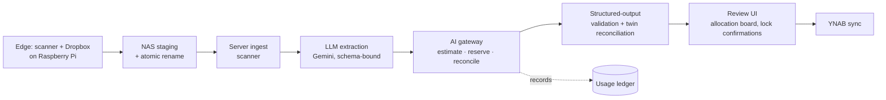

# YNAB Receipt Analyzer

Automates [You Need A Budget](https://www.ynab.com/) (YNAB) transaction entry from scanned receipts. Files flow through an LLM extraction pipeline, into a review UI for human verification, and then sync to YNAB via their API. Each receipt is captured as a structured twin of the physical scan, and every synced transaction carries a back-reference so line-item detail and returns processing stay one click away from inside YNAB. The review UI uses streak mechanics so manual validation doesn't feel like chore work.

Runs as a Docker container on a Synology NAS, with a Raspberry Pi paired to a ScanSnap scanner and Dropbox Scan as the edge ingester.

## Major Components

- `apps/server`: FastAPI backend, RQ workers, Next.js + TypeScript review UI, shared LLM client and contracts
- `edge/pi-outbox-shipper`: Raspberry Pi ingester with stability checks, durable outbox, and idempotent rsync delivery to the NAS
- `infra/nas`: production docker-compose artifacts for the NAS
- `tools/ai_limits.py`: Textual TUI for inspecting and editing LLM cost caps at runtime
- `docs`: architecture, AI gateway design, deployment, and troubleshooting guides

## Pipeline



## Notable engineering

- **Schema-bound LLM extraction.** Gemini calls use Pydantic-bound structured output with cross-field validators (e.g., `category_id` XOR multi-split). A JSON-Schema sanitizer strips fields Gemini's JSON mode rejects. Per-field schema errors are captured on the extraction record. — `apps/server/shared/receipt_shared/gemini.py`, `apps/server/shared/receipt_shared/contracts.py`
- **Application-level AI gateway.** All LLM calls route through a single client that does preflight cost estimation, atomic budget reservation in a write-lock transaction, hard/soft limit enforcement across hourly/daily/weekly/monthly windows on tokens and USD, and post-call reconciliation against the provider's actual usage. The durable usage ledger records operational metadata only — no raw prompts or receipt content. — `apps/server/shared/receipt_shared/ai/`, [`docs/ai-usage-limiter.md`](docs/ai-usage-limiter.md)
- **Multi-attempt extraction with reconciliation.** Receipts run through a unified prompt; on failure or quality miss, a receipt-twin extraction reconciles structured line items against headline totals using configurable drift thresholds before a result is allowed to proceed to sync. — `apps/server/backend/app/jobs/tasks.py`
- **Drag-drop allocation board.** Next.js + TypeScript review UI with autosave, twin-lock confirmations on date/total, and an allocation board (dnd-kit) that reconciles user-pinned amounts against recomputed splits using greedy assignment + largest-remainder allocation. — `apps/server/frontend/src/components/allocation-board.tsx`, `apps/server/backend/app/services/allocation_workspace.py`
- **Durable edge pipeline.** Stability checks before pickup, local outbox with exponential-backoff retry, atomic rename into the NAS incoming path, and idempotent re-delivery via remote existence check. — `edge/pi-outbox-shipper/`
- **Operator TUI.** Textual interface for live cap edits and per-window analytics over the usage ledger. — `python -m tools.ai_limits`

## Documentation

- Architecture: [`docs/architecture.md`](docs/architecture.md)
- AI gateway design: [`docs/ai-usage-limiter.md`](docs/ai-usage-limiter.md)
- AI pricing source notes: [`docs/ai-pricing-sources.md`](docs/ai-pricing-sources.md)
- Pi setup: [`docs/pi-edge-setup.md`](docs/pi-edge-setup.md)
- NAS deployment: [`docs/nas-deploy.md`](docs/nas-deploy.md)
- Troubleshooting: [`docs/troubleshooting.md`](docs/troubleshooting.md)
- Server runtime: [`apps/server/README.md`](apps/server/README.md), [`apps/server/backend/README.md`](apps/server/backend/README.md)
- NAS compose details: [`infra/nas/README.md`](infra/nas/README.md)

## Quickstart (Devcontainer / Local)

1. Install backend and frontend deps:

```bash
pip install -r requirements.txt
cd apps/server/frontend && npm install
```

2. Run migrations:

```bash
alembic -c apps/server/backend/alembic.ini upgrade head
```

3. Run API + worker + scanner:

```bash
PYTHONPATH=apps/server/backend:apps/server/shared uvicorn app.main:app --reload --port 8000
PYTHONPATH=apps/server/backend:apps/server/shared python apps/server/worker/worker.py
PYTHONPATH=apps/server/backend:apps/server/shared python apps/server/worker/scanner.py
```

4. Run the frontend:

```bash
cd apps/server/frontend && npm run dev
```

For the Pi shipper flow, see `edge/pi-outbox-shipper/README.md` and `docs/pi-edge-setup.md`.
