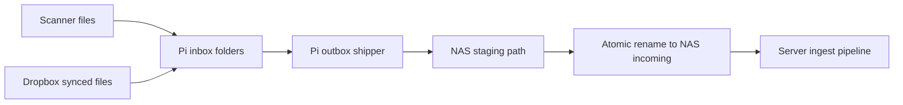

# YNAB Receipt Analyzer

Receipt ingestion and analysis system with a NAS-hosted server runtime and a Raspberry Pi edge shipper. The Pi gathers scanned/Dropbox receipt files, stages them through a durable outbox, and delivers them to the NAS for backend ingestion and processing.

## Major Components

- `apps/server`: core server runtime (FastAPI API, worker/scanner, shared libs, frontend)
- `edge/pi-outbox-shipper`: Raspberry Pi edge ingestion outbox shipper
- `infra/nas`: placeholder production docker-compose artifacts for Synology NAS
- `docs`: architecture, setup, deployment, and troubleshooting guides

## Data Flow



## Documentation Map

- Architecture: `docs/architecture.md`
- Pi setup: `docs/pi-edge-setup.md`
- NAS deployment notes: `docs/nas-deploy.md`
- Troubleshooting playbook: `docs/troubleshooting.md`
- Server runtime details: `apps/server/README.md`
- NAS compose placeholder details: `infra/nas/README.md`

## Quickstart (Devcontainer / Local)

1. Install backend/python deps and frontend deps:

```bash
pip install -r requirements.txt
cd apps/server/frontend && npm install
```

2. Run migrations:

```bash
alembic -c apps/server/backend/alembic.ini upgrade head
```

3. Run API + worker + scanner:

```bash
PYTHONPATH=apps/server/backend:apps/server/shared uvicorn app.main:app --reload --port 8000
PYTHONPATH=apps/server/backend:apps/server/shared python apps/server/worker/worker.py
PYTHONPATH=apps/server/backend:apps/server/shared python apps/server/worker/scanner.py
```

4. Run frontend:

```bash
cd apps/server/frontend && npm run dev
```

For the Pi shipper flow, use `edge/pi-outbox-shipper/README.md` and `docs/pi-edge-setup.md`.
