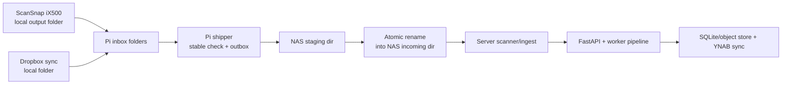

# Architecture

This system ingests receipt files from edge sources (scanner + Dropbox on Raspberry Pi), ships them to NAS storage, and processes them through the server pipeline.

## Runtime Boundaries

- Edge ingestion (Pi): `edge/pi-outbox-shipper`
- Core server runtime (NAS container): `apps/server`
- NAS deployment artifacts: `infra/nas`

## Data Handling

- Pi inbox files are only moved after stability checks (no partial writes).
- Outbox is durable local queue; files are never dropped.
- NAS receives uploads in a staging path first.
- Final ingest path receives files only after atomic rename.

## Failure Modes

### NAS down / rebooting

- Pi rsync/ssh attempts fail.
- File remains in outbox.
- Retry schedule uses exponential backoff up to configured cap.
- Delivery resumes automatically when NAS is reachable again.

### Network blips

- In-flight transfer failure is treated like send failure.
- Outbox file stays local and retries later.
- No partial file is exposed in NAS incoming path.

### Pi reboot during transfer

- Inbox/outbox/state are disk-backed.
- On restart, service resumes scanning and retrying.
- Previously sent files are recognized via state and remote existence checks.
