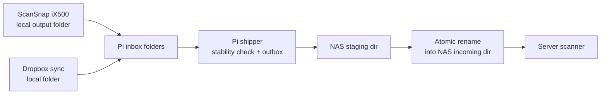
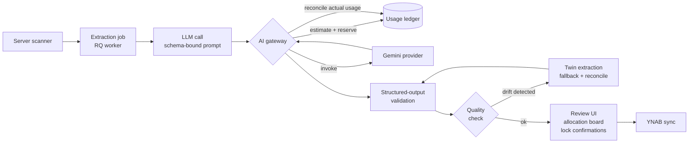

# Architecture

The system has two halves: an **edge ingestion pipeline** that delivers receipt files from a Raspberry Pi to NAS storage, and a **server runtime** on the NAS that runs LLM extraction, validation, a human review UI, and YNAB sync.

## Edge ingestion

- Edge ingestion (Pi): `edge/pi-outbox-shipper`
- Core server runtime (NAS container): `apps/server`
- NAS deployment artifacts: `infra/nas`

## Server runtime

### Extraction pipeline

Receipts run through one of three prompt templates depending on mode (YNAB-only, unified receipt+YNAB, receipt-twin reality). All three call Gemini with a Pydantic-bound JSON schema; a sanitizer strips fields the provider's structured-output mode rejects (e.g., `additionalProperties`). Parsing prefers structured output and falls back to manual JSON parsing with per-field schema-error capture.

- Prompt builders and analyzer: `apps/server/shared/receipt_shared/gemini.py`
- Pydantic schemas with cross-field validators: `apps/server/shared/receipt_shared/contracts.py`
- Job orchestration (unified attempt, twin fallback, quality eval): `apps/server/backend/app/jobs/tasks.py`

### AI gateway and usage ledger

Every LLM call flows through `AIClient`. Per request: estimate token/USD usage, reserve budget atomically inside a write-lock transaction against the durable ledger, invoke the provider adapter, then finalize the ledger record using actual usage from the provider's response. Hard and soft limit modes are configurable; caps apply per-model and globally across hourly/daily/weekly/monthly windows. The ledger persists operational metadata only — no raw prompts or receipt content.

- Gateway and provider adapters: `apps/server/shared/receipt_shared/ai/`
- Versioned model registry and limits config: `apps/server/shared/receipt_shared/resources/ai_model_registry.v1.json`, `config/ai_limits.v1.json`
- Operator TUI: `python -m tools.ai_limits`
- Detailed design: [`docs/ai-usage-limiter.md`](ai-usage-limiter.md)

### Validation and twin reconciliation

After extraction, payloads are validated against the YNAB category and account caches. Receipt twins (structured representations of the receipt as it physically appears) are extracted separately and reconciled against the YNAB-mapped totals; configurable drift thresholds (absolute and percentage) gate whether a result is allowed to proceed. User confirmations on the twin (date/time, total) become locks that downstream edits cannot silently override. Validation rows version safely under concurrent edits using `db.begin_nested()` with `IntegrityError` retry on the unique version constraint.

- Validation: `apps/server/backend/app/services/validation.py`
- Twin extraction and quality eval: `apps/server/backend/app/jobs/tasks.py`

### Allocation workspace

Receipts with multi-category splits use an item-level allocation workspace. Users assign individual line items to splits in a drag-drop board; pinned amounts are preserved while the rest are recomputed using greedy assignment and largest-remainder allocation so the splits sum to the receipt total without rounding drift. The workspace is persisted on the validation row (migration 0007).

- Backend service: `apps/server/backend/app/services/allocation_workspace.py`
- Frontend mirror logic: `apps/server/frontend/src/lib/allocation-workspace.ts`
- UI: `apps/server/frontend/src/components/allocation-board.tsx`

## Data handling

- Pi inbox files are only moved after stability checks (no partial writes).
- The Pi outbox is a durable local queue; files are never dropped.
- The NAS receives uploads in a staging path first.
- The final ingest path receives files only after atomic rename.
- The AI usage ledger does not store raw prompts, receipt text, or file contents.

## Failure modes

### NAS down or rebooting

- Pi rsync/ssh attempts fail.
- File remains in the outbox.
- Retry uses exponential backoff up to a configured cap.
- Delivery resumes automatically when the NAS is reachable again.

### Network blips

- In-flight transfer failure is treated like a send failure.
- Outbox file stays local and retries later.
- No partial file is exposed in the NAS incoming path.

### Pi reboot during transfer

- Inbox, outbox, and state are disk-backed.
- On restart, the service resumes scanning and retrying.
- Previously sent files are recognized via state and remote existence checks.

### Stuck extraction or sync jobs

- On startup, `_reset_stuck_jobs` scans for receipts in `EXTRACTING` or `SYNCING` state older than `stuck_job_timeout_minutes` and resets them to a re-runnable state with the reason logged. Prevents orphaned receipts after a worker crash or container restart.
- Job entry point: `apps/server/backend/app/main.py`

### LLM cost overrun

- Preflight estimation rejects requests that would exceed any active cap (per-model or global; tokens or USD; any window) before the provider is called.
- In-flight `pending` reservations count against window totals so concurrent jobs cannot collectively exceed caps.
- Soft-fail mode lets callers degrade gracefully; hard-fail surfaces an explicit error.
